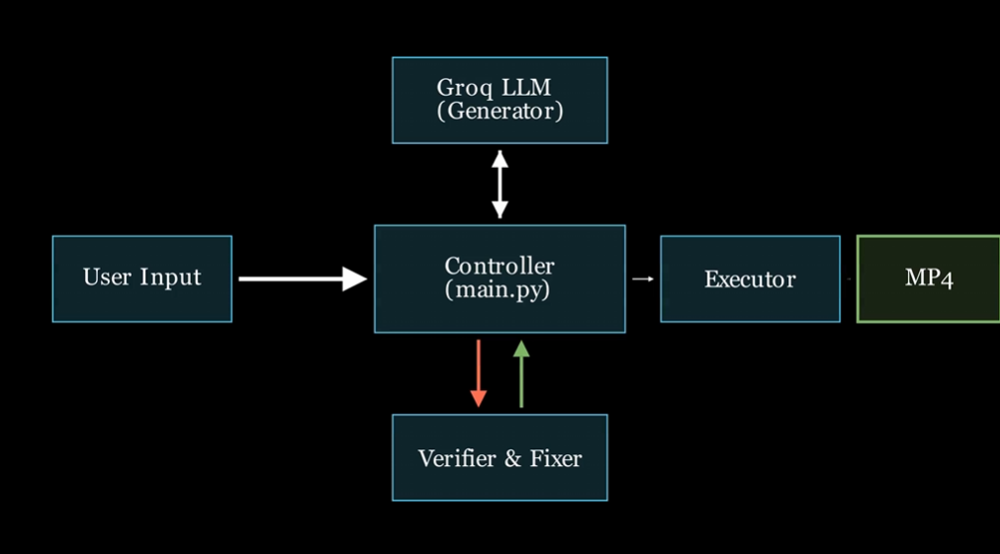

# Prompt2Anim: AI-Powered Manim Animation Generator

**Prompt2Anim** is an intelligent tool that converts natural language descriptions into mathematical animations. By leveraging the speed of Groq’s LLM inference and the precision of the Manim engine, the system automatically generates Python animation code, verifies its correctness, and renders high-quality videos.

---

## 🏗️ Architecture

The system follows a **Generation → Verification → Execution** pipeline to ensure code reliability and safe rendering.


### Pipeline Overview

1. **Prompt Ingestion**  
   The user provides a natural language description via the CLI or Streamlit UI.

2. **Code Generation**  
   Uses the **Groq API** (`llama-3.3-70b-versatile`) to generate Manim Python code.

3. **Verification & Repair**
   - **AST Verification:**  
     Code is parsed using `astunparse` to detect syntax errors and unsafe operations.
   - **Auto-Fixer:**  
     If verification fails, a dedicated *Code Fixer* module uses the LLM to repair the code based on feedback.

4. **Execution**  
   The validated code runs in a sandboxed environment to render the final `.mp4` video.

---

## 🚀 Features

- **Natural Language → Video**  
  Generate mathematical animations without writing Python code.

- **Fast Inference**  
  Powered by Groq for near-instant code generation.

- **Self-Correction**  
  Automatic retry-and-fix loop for broken code.

- **Interactive UI**  
  Streamlit-based web interface for immediate visualization.

- **Dual Modes**  
  Supports both CLI usage and web dashboard.

---

## 📺 Example Usage

**Prompt Used:**
```text
Animate an architecture diagram showing User Input to Controller to Groq LLM (generate code) to Verifier & Fixer (loop) to Manim Executor to Video Output, with sequential animations
```
**Generated Output**
A rendered Manim animation video (`.mp4`) following the prompt.
[](
https://github.com/user-attachments/assets/584fa05d-ef27-4898-9770-9777af8ca5a1
)

## 🛠️ Installation

### Prerequisites
- Python 3.10+
- FFmpeg (required for Manim rendering)
- LaTeX (optional, recommended for math text rendering)

---

### Steps

#### 1. Clone the Repository
```bash
git clone https://github.com/yourusername/manim-ai.git
cd manim-ai
```
### 2. Install Dependencies

```bash
pip install -r requirements.txt
```

### 3. Environment Setup

Create a `.env` file in the project root and add your Groq API key:

```env
GROQ_API_KEY=your_gsk_key_here
```

## 💻 Usage

### Option 1: Web Interface (Recommended)

Launch the Streamlit dashboard:

```bash
streamlit run ui/app.py
```
**Steps:**
1. Enter your animation prompt
2. Select render quality (Low / Medium / High)
3. Download the generated video from the browser

---

### Option 2: Command Line

Run the CLI pipeline:

```bash
python main.py
```
**Steps:**
1. Enter your animation description
2. The system verifies, fixes, and renders the animation
3. Output video path is displayed after completion


## 📂 Project Structure

```bash
manim-ai/
├── executors/          # Handles code execution and rendering
│   └── manim_executor.py
├── fixers/             # Logic for repairing broken code
│   └── code_fixer.py
├── generators/         # LLM interaction via Groq
│   ├── code_generator.py
│   └── prompts.py
├── ui/                 # Streamlit frontend
│   ├── app.py
│   ├── assets/
│   └── components/
├── verifiers/          # AST-based code verification
│   └── ast_verifier.py
├── main.py             # CLI entry point and pipeline orchestrator
└── requirements.txt    # Python dependencies
```
